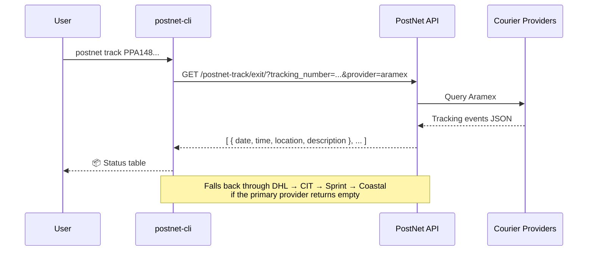
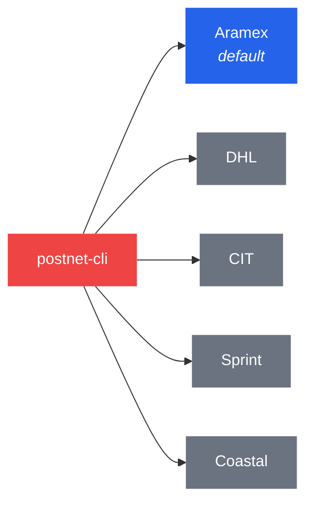
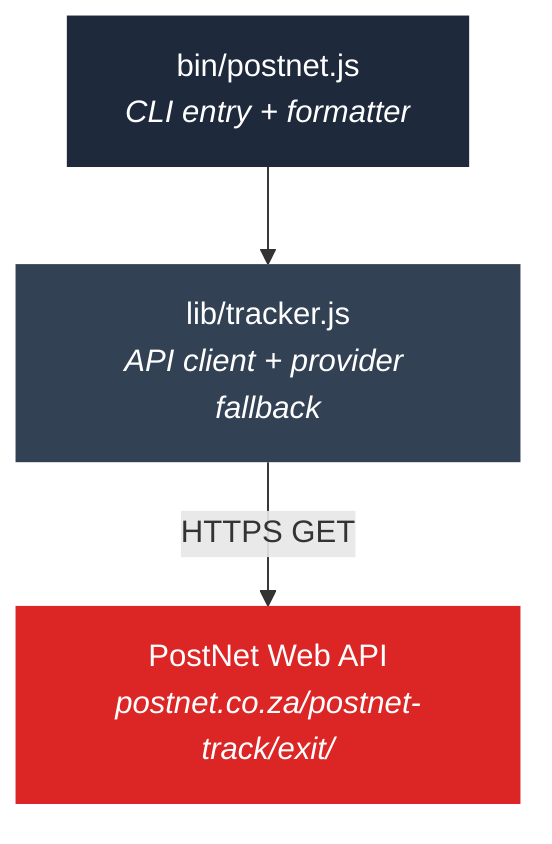

<p align="center">
  
</p>

<h1 align="center">postnet-cli</h1>

<p align="center">
  Track PostNet parcels from the command line.<br/>
  No browser. No auth. No scraping. Just fast results.
</p>

<p align="center">
  <a href="https://www.npmjs.com/package/postnet-cli"></a>
  <a href="https://github.com/yashiels/postnet-cli/blob/main/LICENSE"></a>
  
  = 18" />
</p>

---

## How it works



## Install

```sh
npm install -g postnet-cli
```

Or run directly without installing:

```sh
npx postnet-cli track PPA14811107154
```

## Usage

```sh
# Track a parcel
postnet track PPA14811107154

# JSON output — great for scripting and cron jobs
postnet track PPA14811107154 --json

# Force a specific courier provider
postnet track PPA14811107154 --provider dhl

# Query all five providers at once
postnet track PPA14811107154 --all
```

### Example output

```
  📦 Status: Ready For Collection
  📍 Rondebosch, South Africa — 27 May 2026 09:59 AM

  Date                  Location                   Description
  ────────────────────  ─────────────────────────  ────────────────────────────────────────
  27 May 2026 09:59 AM  Rondebosch, South Africa   Ready For Collection
  27 May 2026 09:18 AM  Cape Town                  Delivered
  27 May 2026 07:17 AM  Cape Town                  Out For Delivery
  26 May 2026 11:14 PM  Cape Town                  Shipment Inbound Received
  26 May 2026 03:10 PM  Stellenbosch               Picked Up From Shipper
  26 May 2026 10:17 AM  Gordons Bay, South Africa  Shipment Created
```

## Providers

PostNet routes parcels through multiple courier networks. The CLI auto-detects which one has your data.



Most domestic PostNet-to-PostNet parcels use **Aramex**, so it's tried first. If it returns empty, the CLI falls back through the remaining providers automatically.

## Programmatic API

```js
const { track, trackAll } = require('postnet-cli');

// Track with auto-detection
const result = await track('PPA14811107154');
// → { provider: 'aramex', events: [{ date, time, location, description }, ...] }

// Query all providers
const all = await trackAll('PPA14811107154');
// → { aramex: [...], dhl: [...], ... }

// Specific provider + custom timeout
const dhl = await track('PPA14811107154', { provider: 'dhl', timeoutMs: 10000 });
```

## CLI reference

```
postnet track <number>              Track a parcel (auto-detects provider)
postnet track <number> --json       Machine-readable JSON output
postnet track <number> --provider X Use a specific provider
postnet track <number> --all        Query all providers
postnet --help                      Show help
postnet --version                   Show version
```

| Flag | Description |
|------|-------------|
| `--json` | Output raw JSON array of tracking events |
| `--provider <name>` | Skip auto-detection, use: `aramex`, `dhl`, `cit`, `sprint`, `coastal` |
| `--all` | Query every provider and show all results |

### Exit codes

| Code | Meaning |
|------|---------|
| `0` | Success — tracking data found |
| `1` | No tracking data or error |

## Architecture



Zero dependencies. Uses Node's built-in `https` module. The entire package is two files:

- **`lib/tracker.js`** — API client with provider fallback logic. Importable for programmatic use.
- **`bin/postnet.js`** — CLI wrapper with human-readable table formatting.

## Contributing

Pull requests welcome. The project uses no build step — edit, test, ship.

```sh
git clone https://github.com/yashiels/postnet-cli.git
cd postnet-cli
npm test
```

## License

[MIT](LICENSE) — Yashiel Sookdeo
