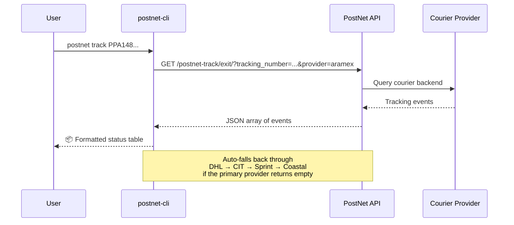
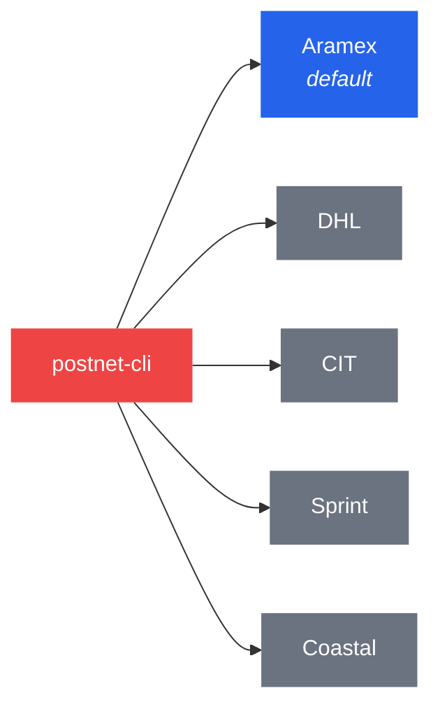
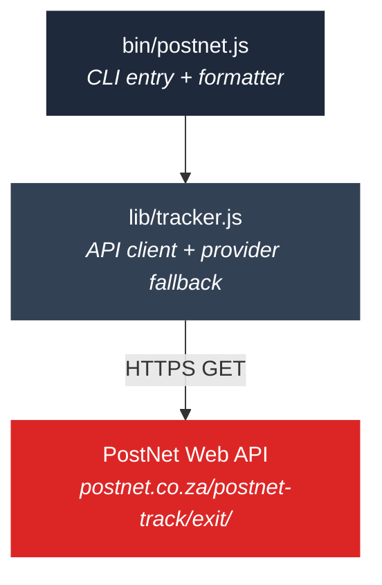

<p align="center">
  
</p>

<h1 align="center">postnet-cli</h1>

<p align="center">
  Track PostNet parcels from the command line.<br/>
  No browser. No auth. No API key. Just results.<br/><br/>
  Built by <a href="https://github.com/yashiels">@yashiels</a>
</p>

<p align="center">
  <a href="https://www.npmjs.com/package/postnet-cli"></a>
  <a href="https://github.com/yashiels/postnet-cli/blob/main/LICENSE"></a>
  
  = 18" />
</p>

---

## Why

The [PostNet tracker page](https://www.postnet.co.za/tracker) works, but it means opening a browser, typing a tracking number, clicking a button, and waiting for a page to render — every single time.

`postnet-cli` hits the same backend API directly. One command, instant results. Pipe to `jq`, wire into a cron job, or call from your own code.

## Install

```sh
npm install -g postnet-cli
```

Or run without installing:

```sh
npx postnet-cli track PPA14811107154
```

## Quick Start

```sh
# Track a parcel
postnet track PPA14811107154

# JSON output — pipe to jq, feed to scripts, wire into cron
postnet track PPA14811107154 --json

# Force a specific courier provider
postnet track PPA14811107154 --provider dhl

# Query all five providers at once
postnet track PPA14811107154 --all
```

### Example output

```
  📦 Status: Ready For Collection
  📍 Rondebosch, South Africa — 27 May 2026 09:59 AM

  Date                  Location                   Description
  ────────────────────  ─────────────────────────  ────────────────────────────────────────
  27 May 2026 09:59 AM  Rondebosch, South Africa   Ready For Collection
  27 May 2026 09:18 AM  Cape Town                  Delivered
  27 May 2026 07:17 AM  Cape Town                  Out For Delivery
  26 May 2026 11:14 PM  Cape Town                  Shipment Inbound Received
  26 May 2026 03:10 PM  Stellenbosch               Picked Up From Shipper
  26 May 2026 10:17 AM  Gordons Bay, South Africa  Shipment Created
```

## How It Works



Hits the same API endpoint as the PostNet tracker webpage. No scraping, no headless browser, no authentication. The entire client is two files using Node's built-in `https` module — zero dependencies.

## Command Reference

| Command | Description |
|---------|-------------|
| `postnet track <number>` | Track a parcel (auto-detects provider) |
| `postnet track <number> --json` | Machine-readable JSON output |
| `postnet track <number> --provider <name>` | Use a specific courier provider |
| `postnet track <number> --all` | Query all providers and show results |
| `postnet --help` | Show help |
| `postnet --version` | Show version |

### Flags

| Flag | Description |
|------|-------------|
| `--json` | Output raw JSON array of tracking events |
| `--provider <name>` | Skip auto-detection. Options: `aramex`, `dhl`, `cit`, `sprint`, `coastal` |
| `--all` | Query every provider and display all results |

### Exit Codes

| Code | Meaning |
|------|---------|
| `0` | Tracking data found |
| `1` | No data found, or request error |

## Providers

PostNet routes parcels through multiple courier networks. The CLI auto-detects which one carries your parcel.



Most domestic PostNet-to-PostNet parcels use **Aramex**, so it's tried first. If it returns empty, the CLI falls back through the remaining providers automatically. Use `--provider` to skip auto-detection or `--all` to query everything.

## Programmatic API

```js
const { track, trackAll } = require('postnet-cli');

// Track with auto-detection + fallback
const result = await track('PPA14811107154');
// → { provider: 'aramex', events: [{ date, time, location, description }, ...] }

// Query all providers at once
const all = await trackAll('PPA14811107154');
// → { aramex: [...], dhl: [...], ... }

// Specific provider + custom timeout
const dhl = await track('PPA14811107154', {
  provider: 'dhl',
  timeoutMs: 10000
});
```

## Agent Integration

All output modes work for both humans and AI agents:

```sh
# Structured JSON for agent consumption
postnet track PPA14811107154 --json | jq '.[0].description'

# Use in a cron job — notify on status change
postnet track PPA14811107154 --json > /tmp/current.json
diff /tmp/previous.json /tmp/current.json && echo "No change" || echo "Status updated!"
```

## Architecture



| File | Role |
|------|------|
| `lib/tracker.js` | API client with provider fallback logic. Importable for programmatic use. |
| `bin/postnet.js` | CLI wrapper: argument parsing + human-readable table formatting. |

## Roadmap

- [x] Track parcels by tracking number
- [x] Auto-detect courier provider with fallback
- [x] JSON output for scripting
- [x] Multi-provider query (`--all`)
- [x] Programmatic Node.js API
- [ ] `postnet watch <number>` — poll mode, exit on delivery
- [ ] Delivery notifications (webhook / stdout event)
- [ ] Multiple tracking numbers in one call
- [ ] npm publish to registry

## Contributing

PRs welcome. No build step — edit, test, ship.

```sh
git clone https://github.com/yashiels/postnet-cli.git
cd postnet-cli
npm test
```

## License

[MIT](LICENSE) — Yashiel Sookdeo
